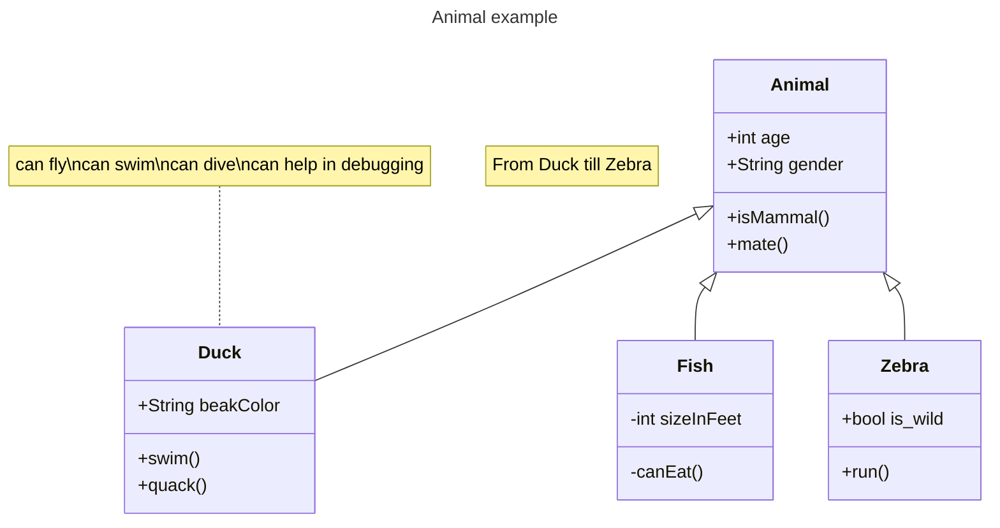
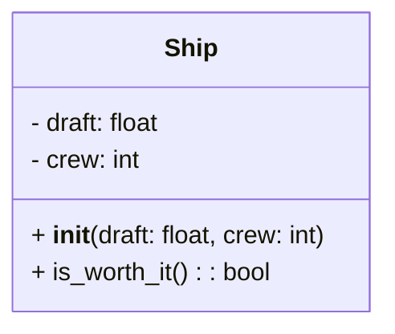

# 实验七 Python 面向对象编程

班级： 21 计科 2

学号： B20210302208

姓名： 何笔男

Github 地址：<https://github.com/JingShil/python_course>

CodeWars 地址：<https://www.codewars.com/users/JingShil>

---

## 实验目的

1. 学习 Python 类和继承的基础知识
2. 学习 namedtuple 和 DataClass 的使用

## 实验环境

1. Git
2. Python 3.10
3. VSCode
4. VSCode 插件

## 实验内容和步骤

### 第一部分

Python 面向对象编程

完成教材《Python 编程从入门到实践》下列章节的练习：

- 第 9 章 类

---

### 第二部分

在[Codewars 网站](https://www.codewars.com)注册账号，完成下列 Kata 挑战：

---

#### 第一题：面向对象的海盗

难度： 8kyu

啊哈，伙计!

你是一个小海盗团的首领。而且你有一个计划。在 OOP 的帮助下，你希望建立一个相当有效的系统来识别船上有大量战利品的船只。
对你来说，不幸的是，现在的人很重，那么你怎么知道一艘船上装的是黄金而不是人呢？

你首先要写一个通用的船舶类。

```python
class Ship:
    def __init__(self, draft, crew):
        self.draft = draft
        self.crew = crew
```

每当你的间谍看到一艘新船进入码头，他们将根据观察结果创建一个新的船舶对象。

- `draft`吃水 - 根据船在水中的高度来估计它的重量
- `crew`船员 - 船上船员的数量

`Titanic = Ship(15, 10)`

任务

你可以访问船舶的 "draft(吃水) "和 "crew(船员)"。"draft(吃水) "是船的总重量，"船员 "是船上的人数。
每个船员都会给船的吃水增加 1.5 个单位。如果除去船员的重量后，吃水仍然超过 20，那么这艘船就值得掠夺。任何有这么重的船一定有很多战利品!
添加方法
`is_worth_it`
来决定这艘船是否值得掠夺。

例如：

```python
Titanic.is_worth_it()
False
```

祝你好运，愿你能找到金子!

代码提交地址：
<https://www.codewars.com/kata/54fe05c4762e2e3047000add>

---

#### 第二题： 搭建积木

难度：7kyu

写一个创建 Block 的类（Duh.）
构造函数应该接受一个数组作为参数，这个数组将包含 3 个整数，其形式为`[width, length, height]`，Block 应该由这些整数创建。

定义这些方法:

- `get_width()` return the width of the `Block`
- `get_length()` return the length of the `Block`
- `get_height()` return the height of the `Block`
- `get_volume()` return the volume of the `Block`
- `get_surface_area()` return the surface area of the `Block`

例子：

```python
b = Block([2,4,6]) # create a `Block` object with a width of `2` a length of `4` and a height of `6`
b.get_width() # return 2
b.get_length() # return 4
b.get_height() # return 6
b.get_volume() # return 48
b.get_surface_area() # return 88
```

注意： 不需要检查错误的参数。

代码提交地址：
<https://www.codewars.com/kata/55b75fcf67e558d3750000a3>

---

#### 第三题： 分页助手

难度：5kyu

在这个练习中，你将加强对分页的掌握。你将完成 PaginationHelper 类，这是一个实用类，有助于查询与数组有关的分页信息。
该类被设计成接收一个值的数组和一个整数，表示每页允许多少个项目。集合/数组中包含的值的类型并不相关。

下面是一些关于如何使用这个类的例子：

```python
helper = PaginationHelper(['a','b','c','d','e','f'], 4)
helper.page_count() # should == 2
helper.item_count() # should == 6
helper.page_item_count(0)  # should == 4
helper.page_item_count(1) # last page - should == 2
helper.page_item_count(2) # should == -1 since the page is invalid

# page_index takes an item index and returns the page that it belongs on
helper.page_index(5) # should == 1 (zero based index)
helper.page_index(2) # should == 0
helper.page_index(20) # should == -1
helper.page_index(-10) # should == -1 because negative indexes are invalid
```

代码提交地址：
<https://www.codewars.com/kata/515bb423de843ea99400000a>

---

#### 第四题： 向量（Vector）类

难度： 5kyu

创建一个支持加法、减法、点积和向量长度的向量（Vector）类。

举例来说：

```python
a = Vector([1, 2, 3])
b = Vector([3, 4, 5])
c = Vector([5, 6, 7, 8])

a.add(b)      # should return a new Vector([4, 6, 8])
a.subtract(b) # should return a new Vector([-2, -2, -2])
a.dot(b)      # should return 1*3 + 2*4 + 3*5 = 26
a.norm()      # should return sqrt(1^2 + 2^2 + 3^2) = sqrt(14)
a.add(c)      # raises an exception
```

如果你试图对两个不同长度的向量进行加减或点缀，你必须抛出一个错误。
向量类还应该提供：

- 一个 `__str__` 方法，这样 `str(a) === '(1,2,3)'`
- 一个 equals 方法，用来检查两个具有相同成分的向量是否相等。

注意：测试案例将利用用户提供的 equals 方法。

代码提交地址：
<https://www.codewars.com/kata/526dad7f8c0eb5c4640000a4>

---

#### 第五题： Codewars 风格的等级系统

难度： 4kyu

编写一个名为 User 的类，用于计算用户在类似于 Codewars 使用的排名系统中的进步量。

业务规则：

- 一个用户从等级-8 开始，可以一直进步到 8。
- 没有 0（零）等级。在-1 之后的下一个等级是 1。
- 用户将完成活动。这些活动也有等级。
- 每当用户完成一个有等级的活动，用户的等级进度就会根据活动的等级进行更新。
- 完成活动获得的进度是相对于用户当前的等级与活动的等级而言的。
- 用户的等级进度从零开始，每当进度达到 100 时，用户的等级就会升级到下一个等级。
- 在上一等级时获得的任何剩余进度都将被应用于下一等级的进度（我们不会丢弃任何进度）。例外的情况是，如果没有其他等级的进展（一旦你达到 8 级，就没有更多的进展了）。
- 一个用户不能超过 8 级。
- 唯一可接受的等级值范围是-8,-7,-6,-5,-4,-3,-2,-1,1,2,3,4,5,6,7,8。任何其他的值都应该引起错误。

逻辑案例：

- 如果一个排名为-8 的用户完成了一个排名为-7 的活动，他们将获得 10 的进度。
- 如果一个排名为-8 的用户完成了排名为-6 的活动，他们将获得 40 的进展。
- 如果一个排名为-8 的用户完成了排名为-5 的活动，他们将获得 90 的进展。
- 如果一个排名-8 的用户完成了排名-4 的活动，他们将获得 160 个进度，从而使该用户升级到排名-7，并获得 60 个进度以获得下一个排名。
- 如果一个等级为-1 的用户完成了一个等级为 1 的活动，他们将获得 10 个进度（记住，零等级会被忽略）。

代码案例：

```python
user = User()
user.rank # => -8
user.progress # => 0
user.inc_progress(-7)
user.progress # => 10
user.inc_progress(-5) # will add 90 progress
user.progress # => 0 # progress is now zero
user.rank # => -7 # rank was upgraded to -7
```

代码提交地址：
<https://www.codewars.com/kata/51fda2d95d6efda45e00004e>

---

### 第三部分

使用 Mermaid 绘制程序的**类图**

安装 VSCode 插件：

- Markdown Preview Mermaid Support
- Mermaid Markdown Syntax Highlighting

使用 Markdown 语法绘制你的程序绘制程序类图（至少一个），Markdown 代码如下：


显示效果如下：



查看 Mermaid 类图的语法-->[点击这里](https://mermaid.js.org/syntax/classDiagram.html)

使用 Markdown 编辑器（例如 VScode）编写本次实验的实验报告，包括[实验过程与结果](#实验过程与结果)、[实验考查](#实验考查)和[实验总结](#实验总结)，并将其导出为 **PDF 格式** 来提交。

## 实验过程与结果

### 习题一

mermaid



python

```python
class Ship:
    def __init__(self, draft, crew):
        self.draft = draft
        self.crew = crew

    def is_worth_it(self):
        if self.draft - self.crew * 1.5 > 20:
            return True
        return False
```

### 习题二

```python
class Block:
    def __init__(self, dimensions):
        self.width = dimensions[0]
        self.length = dimensions[1]
        self.height = dimensions[2]

    def get_width(self):
        return self.width

    def get_length(self):
        return self.length

    def get_height(self):
        return self.height

    def get_volume(self):
        return self.width * self.length * self.height

    def get_surface_area(self):
        return 2 * (self.width * self.length + self.length * self.height + self.height * self.width)
```

### 习题三

```python
class PaginationHelper:
    def __init__(self, collection, items_per_page):
        self.collection = collection
        self.items_per_page = items_per_page

    def item_count(self):
        return len(self.collection)

    def page_count(self):
        return math.ceil(self.item_count() / self.items_per_page)

    def page_item_count(self, page_index):
        if page_index >= self.page_count() or page_index < 0:
            return -1
        start_index = page_index * self.items_per_page
        end_index = start_index + self.items_per_page
        return min(end_index, self.item_count()) - start_index

    def page_index(self, item_index):
        if item_index >= self.item_count() or item_index < 0:
            return -1
        return item_index // self.items_per_page
```

### 习题四

```python
import math

class Vector:
    def __init__(self, vector):
        self.vector = vector

    def __str__(self):
        return '(' + ','.join(str(x) for x in self.vector) + ')'

    def equals(self, other):
        return self.vector == other.vector

    def add(self, other):
        if len(self.vector) != len(other.vector):
            raise ValueError("Vectors must have the same length")
        result = [a + b for a, b in zip(self.vector, other.vector)]
        return Vector(result)

    def subtract(self, other):
        if len(self.vector) != len(other.vector):
            raise ValueError("Vectors must have the same length")
        result = [a - b for a, b in zip(self.vector, other.vector)]
        return Vector(result)

    def dot(self, other):
        if len(self.vector) != len(other.vector):
            raise ValueError("Vectors must have the same length")
        result = sum(a * b for a, b in zip(self.vector, other.vector))
        return result

    def norm(self):
        result = math.sqrt(sum(x ** 2 for x in self.vector))
        return result
```

## 实验考查

请使用自己的语言并使用尽量简短代码示例回答下面的问题，这些问题将在实验检查时用于提问和答辩以及实际的操作。

1. Python 的类中**init**方法起什么作用？

   在 Python 的类中，`__init__`方法是一个特殊的方法，用于初始化类的实例。当创建一个类的实例时，`__init__`方法会自动调用，并且可以在该方法中对实例的属性进行初始化操作。通常情况下，`__init__`方法会接受一些参数，用于初始化实例的属性。

2. Python 语言中如何继承父类和改写（override）父类的方法。

   在 Python 中，继承父类并改写父类的方法可以通过创建一个子类，并在子类中定义与父类方法同名的方法来实现。子类可以通过调用`super()`函数来调用父类的方法，并在该方法的基础上进行修改或扩展。

下面是一个示例代码：

```python
class Parent:
    def greet(self):
        print("Hello, I'm the parent class!")

class Child(Parent):
    def greet(self):
        super().greet()  # 调用父类的方法
        print("Hello, I'm the child class!")

child = Child()
child.greet()
```

输出结果为：

```
Hello, I'm the parent class!
Hello, I'm the child class!
```

3. Python 类有那些特殊的方法？它们的作用是什么？请举三个例子并编写简单的代码说明。

Python 中有一些特殊的方法，它们以双下划线开头和结尾，用于定义类的特殊行为。以下是三个常用的特殊方法及其作用：

- `__str__`方法：用于返回对象的字符串表示。当使用`print`函数或`str`函数打印对象时，会自动调用该方法。

```python
class Person:
    def __init__(self, name):
        self.name = name

    def __str__(self):
        return f"Person: {self.name}"

person = Person("Alice")
print(person)  # 输出：Person: Alice
```

- `__len__`方法：用于返回对象的长度。当使用`len`函数计算对象的长度时，会自动调用该方法。

```python
class MyList:
    def __init__(self, items):
        self.items = items

    def __len__(self):
        return len(self.items)

my_list = MyList([1, 2, 3, 4, 5])
print(len(my_list))  # 输出：5
```

- `__getitem__`方法：用于通过索引访问对象的元素。当使用索引操作符`[]`访问对象的元素时，会自动调用该方法。

```python
class MyList:
    def __init__(self, items):
        self.items = items

    def __getitem__(self, index):
        return self.items[index]

my_list = MyList([1, 2, 3, 4, 5])
print(my_list[2])  # 输出：3
```

这些特殊方法可以根据需要进行自定义，以实现类的特定行为。

## 实验总结

总结一下这次实验你学习和使用到的知识，例如：编程工具的使用、数据结构、程序语言的语法、算法、编程技巧、编程思想。

在这次实验中，我学习和使用到了以下知识：

1. 编程工具的使用：我使用了 Python 编程语言进行实验，并使用了 Python 的开发环境（如 Jupyter Notebook、PyCharm 等）来编写和运行代码。

2. 数据结构：我学习了 Python 中的类和对象的概念，了解了如何创建和使用类来组织和管理数据。

3. 程序语言的语法：我学习了 Python 的类定义语法和特殊方法的使用，掌握了如何定义类、继承父类、重写父类方法等。

4. 算法：虽然本次实验没有涉及具体的算法实现，但我了解了面向对象编程的基本原理和思想，以及如何使用类和对象来解决问题。

通过这次实验，我对 Python 的类和对象有了更深入的理解，掌握了一些基本的面向对象编程的技巧和思想。这些知识将对我今后的编程学习和实践有很大的帮助。
