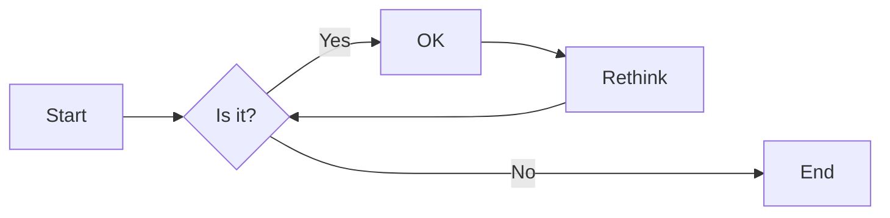
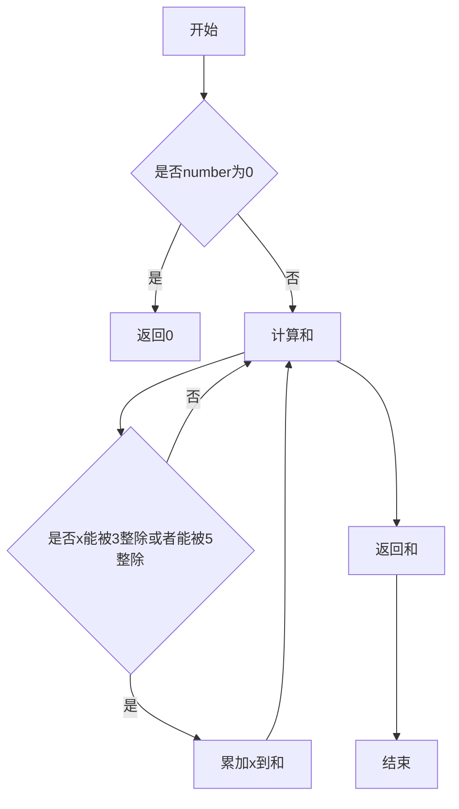
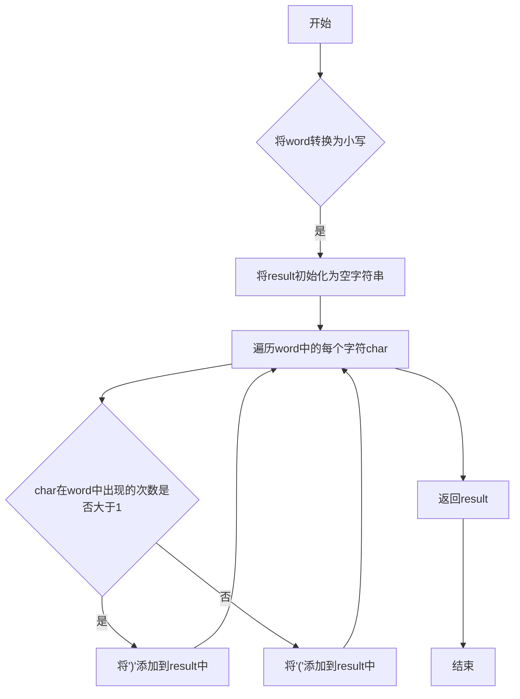
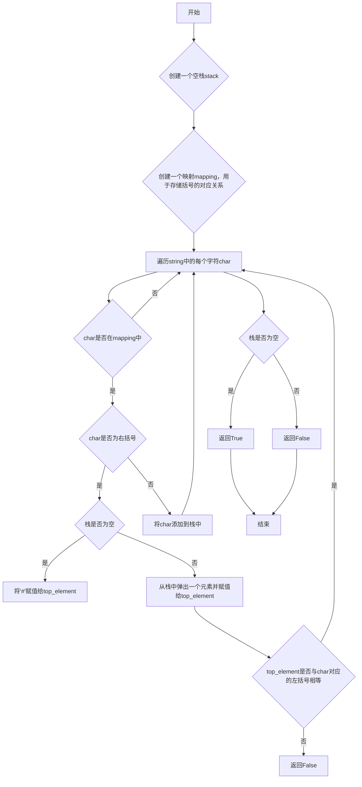
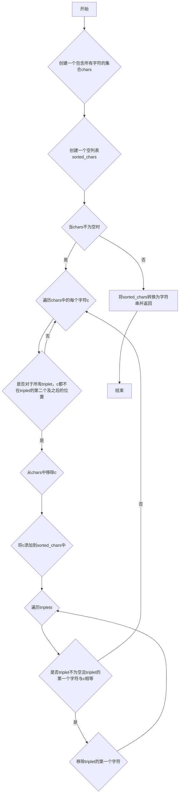
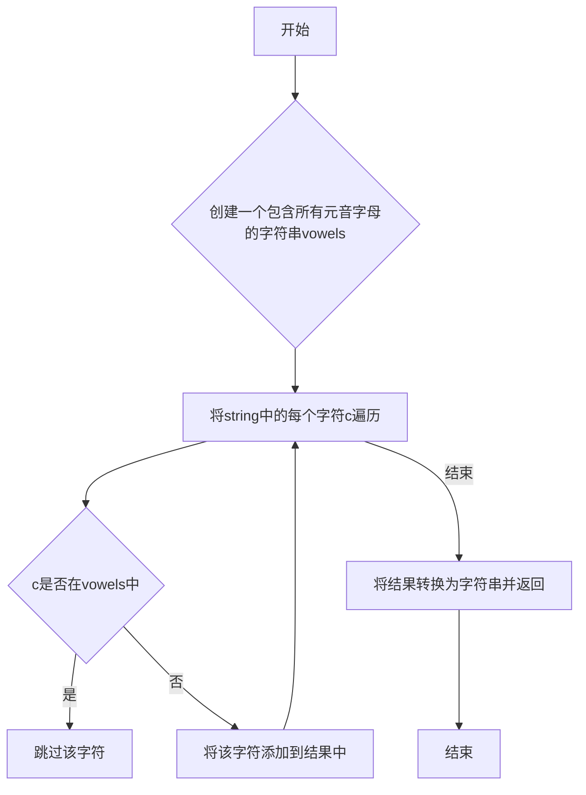

# 实验三 Python列表

班级： 21计科02

学号： B20210302208

姓名： 何笔男

Github地址：<https://github.com/JingShil/python_course>

CodeWars地址：<https://www.codewars.com/users/JingShil>

---

## 实验目的

1. 学习Python的简单使用和列表操作
2. 学习Python中的if语句

## 实验环境

1. Git
2. Python 3.10
3. VSCode
4. VSCode插件

## 实验内容和步骤

### 第一部分

Python列表操作

完成教材《Python编程从入门到实践》下列章节的练习：

- 第3章 列表简介
- 第4章 操作列表
- 第5章 if语句

---

### 第二部分

在[Codewars网站](https://www.codewars.com)注册账号，完成下列Kata挑战：

---

#### 第一题：3和5的倍数（Multiples of 3 or 5）

难度： 6kyu

如果我们列出所有低于 10 的 3 或 5 倍数的自然数，我们得到 3、5、6 和 9。这些数的总和为 23. 完成一个函数，使其返回小于某个整数的所有是3 或 5 的倍数的数的总和。此外，如果数字为负数，则返回 0。

注意：如果一个数同时是3和5的倍数，应该只被算一次。

**提示：首先使用列表解析得到一个列表，元素全部是3或者5的倍数。
使用sum函数可以获取这个列表所有元素的和.**

代码提交地址：
<https://www.codewars.com/kata/514b92a657cdc65150000006>

---

#### 第二题： 重复字符的编码器（Duplicate Encoder）

难度： 6kyu

本练习的目的是将一个字符串转换为一个新的字符串，如果新字符串中的每个字符在原字符串中只出现一次，则为"("，如果该字符在原字符串中出现多次，则为")"。在判断一个字符是否是重复的时候，请忽略大写字母。

例如:

```python
"din"      =>  "((("
"recede"   =>  "()()()"
"Success"  =>  ")())())"
"(( @"     =>  "))(("
```

代码提交地址:
<https://www.codewars.com/kata/54b42f9314d9229fd6000d9c>

---

#### 第三题：括号匹配（Valid Braces）

难度：6kyu

写一个函数，接收一串括号，并确定括号的顺序是否有效。如果字符串是有效的，它应该返回True，如果是无效的，它应该返回False。
例如：

```python
"(){}[]" => True 
"([{}])" => True
 "(}" => False
 "[(])" => False 
"[({})](]" => False
```

**提示：
python中没有内置堆栈数据结构，可以直接使用`list`来作为堆栈，其中`append`方法用于入栈，`pop`方法可以出栈。**

代码提交地址
<https://www.codewars.com/kata/5277c8a221e209d3f6000b56>

---

#### 第四题： 从随机三元组中恢复秘密字符串(Recover a secret string from random triplets)

难度： 4kyu

有一个不为你所知的秘密字符串。给出一个随机三个字母的组合的集合，恢复原来的字符串。

这里的三个字母的组合被定义为三个字母的序列，每个字母在给定的字符串中出现在下一个字母之前。"whi "是字符串 "whatisup "的一个三个字母的组合。

作为一种简化，你可以假设没有一个字母在秘密字符串中出现超过一次。

对于给你的三个字母的组合，除了它们是有效的三个字母的组合以及它们包含足够的信息来推导出原始字符串之外，你可以不做任何假设。特别是，这意味着秘密字符串永远不会包含不出现在给你的三个字母的组合中的字母。

测试用例：

```python
secret = "whatisup"
triplets = [
  ['t','u','p'],
  ['w','h','i'],
  ['t','s','u'],
  ['a','t','s'],
  ['h','a','p'],
  ['t','i','s'],
  ['w','h','s']
]
test.assert_equals(recoverSecret(triplets), secret)
```

代码提交地址：
<https://www.codewars.com/kata/53f40dff5f9d31b813000774/train/python>

提示：

- 利用集合去掉`triplets`中的重复字母，得到字母集合`letters`，最后的`secret`应该由集合中的字母组成，`secret`长度也等于该集合。

```python
letters = {letter for triplet in triplets for letter in triplet }
length = len(letters)
```

- 创建函数`check_first_letter(triplets, first_letter)`，检测一个字母是不是secret的首字母，返回True或者False。
- 创建函数`remove_first_letter(triplets, first_letter)`,  从三元组中去掉首字母，返回新的三元组。
- 遍历字母集合letters，利用上面2个函数得到最后的结果`secret`。

---

#### 第五题： 去掉喷子的元音（Disemvowel Trolls）

难度： 7kyu

喷子正在攻击你的评论区!
处理这种情况的一个常见方法是删除喷子评论中的所有元音(字母：a,e,i,o,u)，以消除威胁。
你的任务是写一个函数，接收一个字符串并返回一个去除所有元音的新字符串。
例如，字符串 "This website is for losers LOL!"   将变成 "Ths wbst s fr lsrs LL!".

注意：对于这个Kata来说，y不被认为是元音。
代码提交地址：
<https://www.codewars.com/kata/52fba66badcd10859f00097e>

提示：

- 首先使用列表解析得到一个列表，列表中所有不是元音的字母。
- 使用字符串的join方法连结列表中所有的字母，例如：

```python
last_name = "lovelace"
letters = [letter for letter in last_name ]
print(letters) # ['l', 'o', 'v', 'e', 'l', 'a', 'c', 'e']
name = ''.join(letters) # name = "lovelace"
```

---

### 第三部分

使用Mermaid绘制程序流程图

安装VSCode插件：

- Markdown Preview Mermaid Support
- Mermaid Markdown Syntax Highlighting

使用Markdown语法绘制你的程序绘制程序流程图（至少一个），Markdown代码如下：


显示效果如下：



查看Mermaid流程图语法-->[点击这里](https://mermaid.js.org/syntax/flowchart.html)

使用Markdown编辑器（例如VScode）编写本次实验的实验报告，包括[实验过程与结果](#实验过程与结果)、[实验考查](#实验考查)和[实验总结](#实验总结)，并将其导出为 **PDF格式** 来提交。

## 实验过程与结果

### 题目一

#### 代码

```python
def solution(number):
    return sum(x for x in range(number) if x % 3 == 0 or x % 5 == 0)
```

#### 程序流程图



### 题目二

#### 代码

```python
def duplicate_encode(word):
    word = word.lower()
    result = ""
    for char in word:
        if word.count(char) > 1:
            result += ")"
        else:
            result += "("
    return result
```

#### 程序流程图



### 题目三

#### 代码

```python
def valid_braces(string):
    stack = []
    mapping = {")": "(", "}": "{", "]": "["}

    for char in string:
        if char in mapping:
            top_element = stack.pop() if stack else '#'
            if mapping[char] != top_element:
                return False
        else:
            stack.append(char)

    return not stack
```

#### 程序流程图



### 题目四

#### 代码

```python
def recoverSecret(triplets):
    chars = set([c for triplet in triplets for c in triplet])
    sorted_chars = []
    while chars:
        for c in chars:
            if all(c not in triplet[1:] for triplet in triplets):
                chars.remove(c)
                sorted_chars.append(c)
                for triplet in triplets:
                    if triplet and triplet[0] == c:
                        triplet.pop(0)
                break
    return ''.join(sorted_chars)
```

#### 程序流程图



### 题目五

#### 代码

```python
def disemvowel(string):
    vowels = 'aeiouAEIOU'
    return ''.join(c for c in string if c not in vowels)
```

#### 程序流程图



## 实验考查

请使用自己的语言并使用尽量简短代码示例回答下面的问题，这些问题将在实验检查时用于提问和答辩以及实际的操作。

1. Python中的列表可以进行以下操作：
   - 添加元素：使用`append()`方法在列表末尾添加元素，使用`insert()`方法在指定位置插入元素。
   - 删除元素：使用`remove()`方法删除指定元素，使用`pop()`方法删除指定位置的元素。
   - 访问元素：使用索引访问列表中的元素，可以使用负索引从末尾开始访问。
   - 切片操作：使用切片操作符`[start:end:step]`获取列表的子列表。
   - 修改元素：通过索引对列表中的元素进行赋值来修改元素的值。
   - 长度和计数：使用`len()`函数获取列表的长度，使用`count()`方法统计指定元素在列表中出现的次数。
   - 排序和反转：使用`sort()`方法对列表进行排序，使用`reverse()`方法将列表反转。
   - 其他操作：包括列表的拼接、重复、迭代、成员关系判断等。

2. 两种常用的方法对Python的列表进行排序是：
   - 使用`sort()`方法：该方法会直接修改原列表，将列表按升序排序。可以通过`reverse=True`参数进行降序排序。
   - 使用`sorted()`函数：该函数会返回一个新的已排序的列表，不会修改原列表。可以通过`reverse=True`参数进行降序排序。

   这两种方法的区别在于对原列表的处理方式。`sort()`方法直接修改原列表，而`sorted()`函数返回一个新的已排序的列表。

3. 要将Python列表逆序打印，可以使用切片操作符`[::-1]`来获取列表的逆序子列表，然后进行打印。示例代码如下：
   
   ```python
   my_list = [1, 2, 3, 4, 5]
   reversed_list = my_list[::-1]
   print(reversed_list)
   ```

4. 在Python中，列表的操作效率取决于具体的操作。以下是一些常见操作的效率情况：
   - 访问元素：通过索引访问元素的效率很高，时间复杂度为O(1)。
   - 添加和删除元素：在列表末尾添加元素的效率很高，时间复杂度为O(1)。但是，在列表的开头或中间插入或删除元素的效率较低，时间复杂度为O(n)。
   - 切片操作：切片操作的效率取决于切片的大小，时间复杂度为O(k)，其中k是切片的大小。
   - 排序：使用`sort()`方法对列表进行排序的效率较高，时间复杂度为O(nlogn)。但是，使用`sorted()`函数对列表进行排序的效率较低，时间复杂度为O(nlogn)。
   - 其他操作：列表的拼接、重复、迭代等操作的效率较高，时间复杂度为O(n)。

   如果需要在频繁进行插入和删除操作的场景中提高效率，可以考虑使用链表（linked list）这样的数据结构来替代列表。

5. 《Fluent Python》Chapter 2. An Array of Sequence - Tuples Are Not Just Immutable Lists小节主要介绍了元组（tuple）的特点和用法。主要内容包括：
   - 元组是不可变的序列，与列表相比，元组的元素不能被修改、添加或删除。
   - 元组可以包含任意类型的元素，可以通过索引访问元素。
   - 元组可以用作字典的键，而列表不能。
   - 元组可以用作函数的参数和返回值，可以通过元组来传递多个值。
   - 元组可以通过解包（unpacking）来将元组的元素赋值

## 实验总结

总结一下这次实验你学习和使用到的知识，例如：编程工具的使用、数据结构、程序语言的语法、算法、编程技巧、编程思想。

在这次实验中，我学习和使用到了以下知识：

1. 编程工具的使用：我使用了Python作为编程语言，并使用了Python的开发环境（如Jupyter Notebook）来编写和运行代码。

2. 数据结构：我学习了Python中的列表（list）和元组（tuple）这两种常用的序列数据结构。了解了它们的特点、操作和效率。

3. 程序语言的语法：通过编写Python代码，我复习了Python的基本语法，包括变量、条件语句、循环语句、函数定义等。

4. 算法：在实验中，我学习了一些常见的算法和算法思想，如遍历、排序、反转等。通过编写代码，我实践了这些算法的实现。

5. 编程技巧：在编写代码的过程中，我学习了一些编程技巧，如列表推导式、切片操作、字符串拼接等。这些技巧可以提高代码的简洁性和效率。

6. 编程思想：在实验中，我学习了一些编程思想，如模块化、可读性、可维护性等。这些思想可以帮助我编写更好的代码。

通过这次实验，我不仅学习了具体的知识和技能，还培养了一些编程的思维方式和习惯，提高了自己的编程能力。