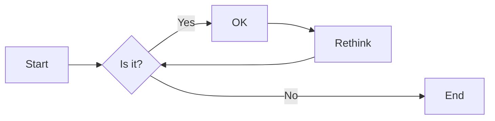
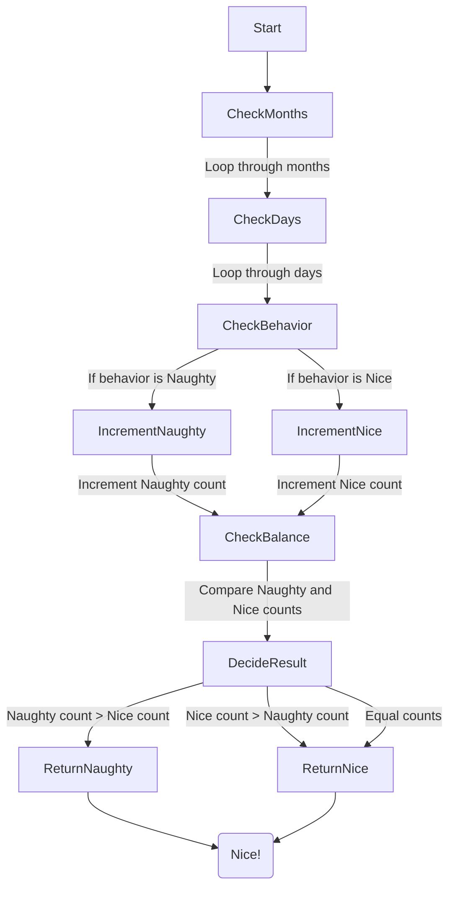

# 实验四 Python 字典和 while 循环

班级： 21 计科 2

学号： B20210302208

姓名： 何笔男

Github 地址：<https://github.com/JingShil/python_course>

CodeWars 地址：<https://www.codewars.com/users/JingShil>

---

## 实验目的

1. 学习 Python 字典
2. 学习 Python 用户输入和 while 循环

## 实验环境

1. Git
2. Python 3.10
3. VSCode
4. VSCode 插件

## 实验内容和步骤

### 第一部分

Python 列表操作

完成教材《Python 编程从入门到实践》下列章节的练习：

- 第 6 章 字典
- 第 7 章 用户输入和 while 循环

---

### 第二部分

在[Codewars 网站](https://www.codewars.com)注册账号，完成下列 Kata 挑战：

---

#### 第一题：淘气还是乖孩子（Naughty or Nice）

难度： 7kyu

圣诞老人要来镇上了，他需要你帮助找出谁是淘气的或善良的。你将会得到一整年的 JSON 数据，按照这个格式：

```python
{
    January: {
        '1': 'Naughty','2': 'Naughty', ..., '31': 'Nice'
    },
    February: {
        '1': 'Nice','2': 'Naughty', ..., '28': 'Nice'
    },
    ...
    December: {
        '1': 'Nice','2': 'Nice', ..., '31': 'Naughty'
    }
}
```

你的函数应该返回 "Naughty!"或 "Nice!"，这取决于在某一年发生的总次数（以较大者为准）。如果两者相等，则返回 "Nice！"。
代码提交地址：
<https://www.codewars.com/kata/5662b14e0a1fb8320a00005c>

---

#### 第二题： 观察到的 PIN（The observed PIN）

难度：4kyu

好了，侦探，我们的一个同事成功地观察到了我们的目标人物，抢劫犯罗比。我们跟踪他到了一个秘密仓库，我们认为在那里可以找到所有被盗的东西。这个仓库的门被一个电子密码锁所保护。不幸的是，我们的间谍不确定他看到的密码，当罗比进入它时。

键盘的布局如下：

```python
┌───┬───┬───┐
│ 1 │ 2 │ 3 │
├───┼───┼───┤
│ 4 │ 5 │ 6 │
├───┼───┼───┤
│ 7 │ 8 │ 9 │
└───┼───┼───┘
    │ 0 │
    └───┘
```

他注意到密码 1357，但他也说，他看到的每个数字都有可能是另一个相邻的数字（水平或垂直，但不是对角线）。例如，代替 1 的也可能是 2 或 4。而不是 5，也可能是 2、4、6 或 8。

他还提到，他知道这种锁。你可以无限制地输入错误的密码，但它们最终不会锁定系统或发出警报。这就是为什么我们可以尝试所有可能的（\*）变化。

\*可能的意义是：观察到的 PIN 码本身和考虑到相邻数字的所有变化。

你能帮助我们找到所有这些变化吗？如果有一个函数，能够返回一个列表，其中包含一个长度为 1 到 8 位的观察到的 PIN 的所有变化，那就更好了。我们可以把这个函数命名为 getPINs（在 python 中为 get_pins，在 C#中为 GetPINs）。

但请注意，所有的 PINs，包括观察到的 PINs 和结果，都必须是字符串，因为有可能会有领先的 "0"。我们已经为你准备了一些测试案例。
侦探，我们就靠你了!
代码提交地址：
<https://www.codewars.com/kata/5263c6999e0f40dee200059d>

---

#### 第三题： RNA 到蛋白质序列的翻译（RNA to Protein Sequence Translation）

难度：6kyu

蛋白质是由 DNA 转录成 RNA，然后转译成蛋白质的中心法则。RNA 和 DNA 一样，是由糖骨架（在这种情况下是核糖）连接在一起的长链核酸。每个由三个碱基组成的片段被称为密码子。称为核糖体的分子机器将 RNA 密码子转译成氨基酸链，称为多肽链，然后将其折叠成蛋白质。

蛋白质序列可以像 DNA 和 RNA 一样很容易地可视化，作为大字符串。重要的是要注意，“停止”密码子不编码特定的氨基酸。它们的唯一功能是停止蛋白质的转译，因此它们不会被纳入多肽链中。“停止”密码子不应出现在最终的蛋白质序列中。为了节省您许多不必要（和乏味）的键入，已为您的氨基酸字典提供了键和值。

给定一个 RNA 字符串，创建一个将 RNA 转译为蛋白质序列的函数。注意：测试用例将始终生成有效的字符串。

```python
protein（'UGCGAUGAAUGGGCUCGCUCC'）
```

将返回`CDEWARS`

作为测试用例的一部分是一个真实世界的例子！最后一个示例测试用例对应着一种叫做绿色荧光蛋白的蛋白质，一旦被剪切到另一个生物体的基因组中，像 GFP 这样的蛋白质可以让生物学家可视化细胞过程！

Amino Acid Dictionary

```python
   # Your dictionary is provided as PROTEIN_DICT
   PROTEIN_DICT = {
    # Phenylalanine
    'UUC': 'F', 'UUU': 'F',
    # Leucine
    'UUA': 'L', 'UUG': 'L', 'CUU': 'L', 'CUC': 'L', 'CUA': 'L', 'CUG': 'L',
    # Isoleucine
    'AUU': 'I', 'AUC': 'I', 'AUA': 'I',
    # Methionine
    'AUG': 'M',
    # Valine
    'GUU': 'V', 'GUC': 'V', 'GUA': 'V', 'GUG': 'V',
    # Serine
    'UCU': 'S', 'UCC': 'S', 'UCA': 'S', 'UCG': 'S', 'AGU': 'S', 'AGC': 'S',
    # Proline
    'CCU': 'P', 'CCC': 'P', 'CCA': 'P', 'CCG': 'P',
    # Threonine
    'ACU': 'T', 'ACC': 'T', 'ACA': 'T', 'ACG': 'T',
    # Alanine
    'GCU': 'A', 'GCC': 'A', 'GCA': 'A', 'GCG': 'A',
    # Tyrosine
    'UAU': 'Y', 'UAC': 'Y',
    # Histidine
    'CAU': 'H', 'CAC': 'H',
    # Glutamine
    'CAA': 'Q', 'CAG': 'Q',
    # Asparagine
    'AAU': 'N', 'AAC': 'N',
    # Lysine
    'AAA': 'K', 'AAG': 'K',
    # Aspartic Acid
    'GAU': 'D', 'GAC': 'D',
    # Glutamic Acid
    'GAA': 'E', 'GAG': 'E',
    # Cystine
    'UGU': 'C', 'UGC': 'C',
    # Tryptophan
    'UGG': 'W',
    # Arginine
    'CGU': 'R', 'CGC': 'R', 'CGA': 'R', 'CGG': 'R', 'AGA': 'R', 'AGG': 'R',
    # Glycine
    'GGU': 'G', 'GGC': 'G', 'GGA': 'G', 'GGG': 'G',
    # Stop codon
    'UAA': 'Stop', 'UGA': 'Stop', 'UAG': 'Stop'
}
```

代码提交地址：
<https://www.codewars.com/kata/555a03f259e2d1788c000077>

---

#### 第四题： 填写订单（Thinkful - Dictionary drills: Order filler）

难度：8kyu

您正在经营一家在线业务，您的一天中很大一部分时间都在处理订单。随着您的销量增加，这项工作占用了更多的时间，不幸的是最近您遇到了一个情况，您接受了一个订单，但无法履行。

您决定写一个名为`fillable()`的函数，它接受三个参数：一个表示您库存的字典`stock`，一个表示客户想要购买的商品的字符串`merch`，以及一个表示他们想购买的商品数量的整数 n。如果您有足够的商品库存来完成销售，则函数应返回`True`，否则应返回`False`。

有效的数据将始终被传入，并且 n 将始终大于等于 1。

代码提交地址：
<https://www.codewars.com/kata/586ee462d0982081bf001f07/python>

---

#### 第五题： 莫尔斯码解码器（Decode the Morse code, advanced）

难度： 4kyu

在这个作业中，你需要为有线电报编写一个莫尔斯码解码器。
有线电报通过一个有按键的双线路运行，当按下按键时，会连接线路，可以在远程站点上检测到。莫尔斯码将每个字符的传输编码为"点"（按下按键的短按）和"划"（按下按键的长按）的序列。

在传输莫尔斯码时，国际标准规定：

- "点" - 1 个时间单位长。
- "划" - 3 个时间单位长。
- 字符内点和划之间的暂停 - 1 个时间单位长。
- 单词内字符之间的暂停 - 3 个时间单位长。
- 单词间的暂停 - 7 个时间单位长。

但是，该标准没有规定"时间单位"有多长。实际上，不同的操作员会以不同的速度进行传输。一个业余人士可能需要几秒钟才能传输一个字符，一位熟练的专业人士可以每分钟传输 60 个单词，而机器人发射器可能会快得多。

在这个作业中，我们假设消息的接收是由硬件自动执行的，硬件会定期检查线路，如果线路连接（远程站点的按键按下），则记录为 1，如果线路未连接（远程按键弹起），则记录为 0。消息完全接收后，它会以一个只包含 0 和 1 的字符串的形式传递给你进行解码。

例如，消息`HEYJUDE`，即`·····−·−−··−−−··−−··`可以如下接收：

```python
1100110011001100000011000000111111001100111111001111110000000000000011001111110011111100111111000000110011001111110000001111110011001100000011
```

如您所见，根据标准，这个传输完全准确，硬件每个"点"采样了两次。

因此，你的任务是实现两个函数：

函数 decodeBits(bits)，应该找出消息的传输速率，正确解码消息为点（.）、划（-）和空格（字符之间有一个空格，单词之间有三个空格），并将它们作为一个字符串返回。请注意，在消息的开头和结尾可能会出现一些额外的 0，确保忽略它们。另外，如果你无法分辨特定的 1 序列是点还是划，请假设它是一个点。

函数 decodeMorse(morseCode)，它将接收上一个函数的输出，并返回一个可读的字符串。

注意：出于编码目的，你必须使用 ASCII 字符.和-，而不是 Unicode 字符。

莫尔斯码表已经预加载给你了（请查看解决方案设置，以获取在你的语言中使用它的标识符）。

```python
morseCodes(".--")  #to access the morse translation of ".--"
```

下面是 Morse 码支持的完整字符列表：

```javascript
A    ·–
B    –···
C    –·–·
D    –··
E    ·
F    ··–·
G    ––·
H    ····
I    ··
J    ·–––
K    –·–
L    ·–··
M    ––
N    –·
O    –––
P    ·––·
Q    ––·–
R    ·–·
S    ···
T    –
U    ··–
V    ···–
W    ·––
X    –··–
Y    –·––
Z    ––··
0    –––––
1    ·––––
2    ··–––
3    ···––
4    ····–
5    ·····
6    –····
7    ––···
8    –––··
9    ––––·
.    ·–·–·–
,    ––··––
?    ··––··
'    ·––––·
!    –·–·––
/    –··–·
(    –·––·
)    –·––·–
&    ·–···
:    –––···
;    –·–·–·
=    –···–
+    ·–·–·
-    –····–
_    ··––·–
"    ·–··–·
$    ···–··–
@    ·––·–·
```

代码提交地址：
<https://www.codewars.com/kata/decode-the-morse-code-advanced>

---

### 第三部分

使用 Mermaid 绘制程序流程图

安装 VSCode 插件：

- Markdown Preview Mermaid Support
- Mermaid Markdown Syntax Highlighting

使用 Markdown 语法绘制你的程序绘制程序流程图（至少一个），Markdown 代码如下：


显示效果如下：



查看 Mermaid 流程图语法-->[点击这里](https://mermaid.js.org/syntax/flowchart.html)

使用 Markdown 编辑器（例如 VScode）编写本次实验的实验报告，包括[实验过程与结果](#实验过程与结果)、[实验考查](#实验考查)和[实验总结](#实验总结)，并将其导出为 **PDF 格式** 来提交。

## 实验过程与结果

### 题目一

#### 代码

```python
def naughty_or_nice(data):
    naughty_count = 0
    nice_count = 0

    for month in data.values():
        for day in month.values():
            if day == 'Naughty':
                naughty_count += 1
            elif day == 'Nice':
                nice_count += 1

    if naughty_count > nice_count:
        return "Naughty!"
    elif nice_count > naughty_count:
        return "Nice!"
    else:
        return "Nice!"
```

#### 程序流程图



### 题目二

#### 代码

```python
def get_pins(observed):
    adjacent_digits = {
        '0': ['0', '8'],
        '1': ['1', '2', '4'],
        '2': ['1', '2', '3', '5'],
        '3': ['2', '3', '6'],
        '4': ['1', '4', '5', '7'],
        '5': ['2', '4', '5', '6', '8'],
        '6': ['3', '5', '6', '9'],
        '7': ['4', '7', '8'],
        '8': ['5', '7', '8', '9', '0'],
        '9': ['6', '8', '9']
    }

    def generate_pins(prefix, remaining_digits):
        if not remaining_digits:
            return [prefix]
        digit = remaining_digits[0]
        rest_digits = remaining_digits[1:]
        pins = []
        for neighbor in adjacent_digits[digit]:
            pins.extend(generate_pins(prefix + neighbor, rest_digits))
        return pins

    return generate_pins('', observed)
```

### 题目三

#### 代码

```python
def protein(rna):
    protein_sequence = ''
    codon = ''

    for letter in rna:
        codon += letter
        if len(codon) == 3:
            if PROTEIN_DICT[codon] == 'Stop':
                break
            protein_sequence += PROTEIN_DICT[codon]
            codon = ''

    return protein_sequence
```

### 题目四

#### 代码

```python
def fillable(stock, merch, n):
    if merch in stock and stock[merch] >= n:
        return True
    else:
        return False
```

## 实验考查

请使用自己的语言并使用尽量简短代码示例回答下面的问题，这些问题将在实验检查时用于提问和答辩以及实际的操作。

### 问题 1：字典的键和值有什么区别？

字典（Dictionary）是 Python 中一种数据结构，用于存储键-值对。键和值在字典中有不同的作用和性质：

- 键（Key）：

  - 键是字典中的唯一标识符，每个键在字典中必须是唯一的，不允许重复。
  - 键通常用来查找对应的值，因此它们起到索引的作用。
  - 键必须是不可变的数据类型，通常使用字符串、数字或元组作为键。

- 值（Value）：
  - 值是与键关联的数据，可以是任何数据类型，包括数字、字符串、列表、字典等。
  - 值可以重复，不需要唯一性，不同键可以关联相同的值。

### 问题 2：在读取和写入字典时，需要使用默认值可以使用什么方法？

在 Python 中，你可以使用`get()`方法或字典的索引操作来读取字典中的值，并为不存在的键提供默认值。以下是两种方法的示例：

在上述示例中，如果键"c"不存在于字典中，两种方法都会返回默认值 0。

### 问题 3：Python 中的 while 循环和 for 循环有什么区别？

Python 中的`while`循环和`for`循环是两种不同的循环结构，具有以下区别：

- `while`循环：

  - `while`循环是一种条件控制的循环结构，它会在满足一定条件的情况下反复执行一段代码块。
  - 循环的执行次数取决于条件的真假，如果条件一直为真，可能会导致无限循环。
  - 适用于需要根据条件进行迭代的情况，例如处理用户输入、事件驱动的操作等。

- `for`循环：
  - `for`循环是一种迭代循环，用于遍历序列（如列表、元组、字符串）或可迭代对象（如字典、集合）中的元素。
  - 循环的执行次数由序列的长度决定，不需要明确的条件表达式。
  - 适用于对序列或可迭代对象进行遍历的情况。

总之，`while`循环适用于需要基于条件控制的灵活迭代，而`for`循环适用于遍历序列或可迭代对象的情况。

### 问题 4：阅读[PEP 636 – Structural Pattern Matching: Tutorial](https://peps.python.org/pep-0636/), 总结 Python 3.10 中新出现的 match 语句的使用方法。

Python 3.10 中引入了`match`语句，它是一种模式匹配语句，用于更强大和灵活的条件匹配。以下是一些`match`语句的基本用法总结：

- `match`语句用于取代`if-elif-else`条件结构，更清晰地处理多种条件情况。

- `match`语句可以根据不同的模式匹配条件执行相应的代码块。

- `match`语句支持多种模式，包括常量模式、变量模式、序列模式、字典模式等。

- 使用`case`子句来表示不同的模式匹配情况，每个`case`子句包括要匹配的模式和相应的执行代码块。

- 可以使用`case`子句的`as`关键字来提取匹配的值并将其分配给变量。

## 实验总结

字典的理解：学习了字典数据结构，明确了键和值之间的区别，以及如何使用字典存储和检索数据。字典在 Python 中是非常有用的数据结构，用于关联和映射键值对。

条件控制和默认值：了解了如何在字典操作中使用条件控制和默认值，尤其是使用 get()方法或索引操作来处理不存在的键，以避免 KeyError 异常。

循环结构的区别：对 Python 中的 while 循环和 for 循环进行了比较。while 适用于基于条件的迭代，而 for 用于迭代序列或可迭代对象。了解何时选择哪种循环结构非常重要。
